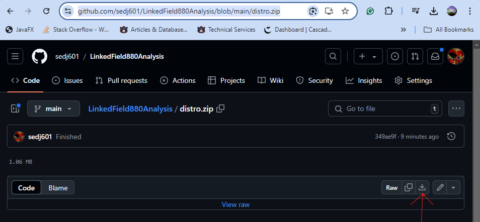

# LinkedField880Analysis

## About
This app finds the linking subfields $6 in a MARC file. It attempts to find the corresponding linked field. It generates two reports for each MARC record. The good report lists good linkage. The bad report lists linked fields that have no corresponding linked field.

## Requirements
 1. OpenJDK 22 or higher

## Run
 1. Download distro.zip.
 2. Extract the contents to your machine.
 3. Double-click Run App.bat

## Download Distro.zip
Go to https://github.com/sedj601/LinkedField880Analysis/blob/main/distro.zip and click the download icon.

##Note:
This app uses MARC4J v 2.9.5. It has Vulnerabilities from dependencies. Let your IT person review the app and make a decision.
MAR4J info: https://mvnrepository.com/artifact/org.marc4j/marc4j/2.9.5
